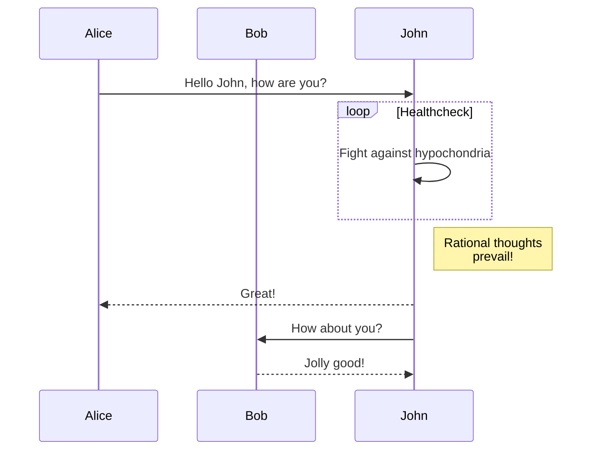

### Main steps  
- Create a layout
- Adding Mermaid to a content template
- Maintaining content and theme styles
- Rendering an example diagram

### Mermaid diagram

This post outlines how to add Mermaid support with Hugo to render the diagram below, as I found the docs a bit lacking.

> When pasting, make sure to move the closing code fence to a new line to see the diagram

```


### Creating a layout

While Mermaid markdown diagrams aren't supported natively by Hugo, it's easy to add. 

As the docs mention the first step is to create `layouts/_default/_markup/render-codeblock-mermaid.html`: 

```
<pre class="mermaid">
  {{- .Inner | safeHTML }}
</pre>
{{ .Page.Store.Set "hasMermaid" true }}
```
### Adding Mermaid to a content template
The next step is less obvious, while the docs mention to add a code block to a content template it needs a bit of clarification. 

A content template template is what Hugo uses to render types of pages: list, single, summary. 

- List: the list view of your posts
- Summary: the small section in visible before clicking into a post
- Single: the content of your post

We'll focus on the 'single' as this is where the diagrams will be rendered. So under `layouts/_default/` you can create a `single.html` file to then add the code snippet to handle the Mermaid diagrams. 

```
{{ if .Page.Store.Get "hasMermaid" }}
  <script type="module">
    import mermaid from 'https://cdn.jsdelivr.net/npm/mermaid/dist/mermaid.esm.min.mjs';
    mermaid.initialize({ startOnLoad: true });
  </script>
{{ end }}
```
### Maintaining content and theme styles
Adding the code above on it's own will make all your 'single' posts 404 as we haven't told Hugo to render any content because omitted a `.Content` block. The reason for this is because of the [render order](https://gohugo.io/templates/views/#which-template-will-be-rendered) Hugo has. As such, the default behaviour of the template was overridden and we removed the content and styles. 

Hugo uses the following lookup order for content views: 

1. `/layouts/<TYPE>/<VIEW>.html`
2. `/layouts/_default/<VIEW>.html`
3. `/themes/<THEME>/layouts/<TYPE>/<VIEW>.html`
4. `/themes/<THEME>/layouts/_default/<VIEW>.html`

To update and maintain your changes, go to your theme provider's layout folder copy the layout and then create a new file in your own layouts folder. 

I'm using the PaperMod theme and my version would be: 

`/themes/PaperMod/layouts/single.html`

and then copy the entire file to:

`/layouts/_default/single.html`

Now, we're able to override the PaperMod theme and subsequent updates won't change our configuration. 

...But we're still not seeing a Mermaid diagram. To do this, we need to find the `.Content` block and add the Mermaid script for Hugo to render diagrams. 

In the 'single' file, find the `.Content` block and update it to use the Mermaid script from the Hugo docs. My layout Content block looks something like this: 

```
{{- if .Content }}
    <div class="post-content">
        {{- if not (.Param "disableAnchoredHeadings") }}
        {{- partial "anchored_headings.html" .Content -}}
        {{- else }}{{ .Content }}{{ end }}
    </div>
    {{ if .Page.Store.Get "hasMermaid" }}
    <script type="module">
        import mermaid from 'https://cdn.jsdelivr.net/npm/mermaid/dist/mermaid.esm.min.mjs';
        mermaid.initialize({ startOnLoad: true });
    </script>
    {{ end }}
```

Notice that the script is inside the `if .Content` block.

### Rendering an example diagram

If you now run `hugo new posts/diagrams.md` to create a new post, add the example Mermaid diagram at the top and execute `hugo server -D` ('D' to render drafts), it should now render. 

FYI, if you don't have a `posts` directory, just switch it to wherever you keep your `.md` files.

The diagram: 



Links
- [Hugo docs: Mermaid diagrams](https://gohugo.io/content-management/diagrams/#mermaid-diagrams)
- [Hugo docs: Content view templates](https://gohugo.io/templates/views/)

